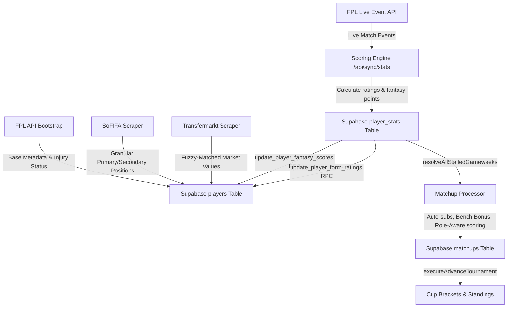

# Gaffa

Gaffa is a highly customized, dynasty-style fantasy football (soccer) application designed for a single private league, live at [gaffa.live](https://gaffa.live). Unlike mainstream platforms (e.g., Sleeper, ESPN, or standard FPL) that rely on arbitrary point allocations, Gaffa mirrors real-world football tactical roles, economics, and match context. Players are valued via free agent bidding using a virtual currency economy and scored contextually based on their on-pitch stats using a custom mathematical normalization engine.

---

## Tech Stack

The application is built on a modern, robust serverless architecture designed for real-time calculation and transactional integrity:

- **Frontend**: Next.js App Router (utilizing React Server Components and React 19) for dynamic, fast-loading user interfaces. Styling is implemented entirely with CSS Modules to maintain a strict, token-based premium custom design system without the overhead of utility-class frameworks. Animations are handled via Framer Motion.
- **Backend & Database**: Supabase (PostgreSQL) manages user authentication, relational tables, and Row Level Security (RLS) policies. Critical game actions—such as processing transactions, resolving waiver claims, and updating player rankings—are built on PostgreSQL stored procedures, triggers, and RPC functions. Automated sync routines are powered by PostgreSQL `pg_cron` jobs and Vercel Cron.
- **Data Ingestion & Pipelines**: Ingestion pipelines run in Next.js API routes and utilize Playwright scrapers to coordinate three primary data sources:
  - **FPL API**: Sourced for live match stats, event details, fixtures, player availability status, and baseline point metrics.
  - **SoFIFA API**: Sourced to scrape granular tactical positions and secondary positions from the EA Sports FC database.
  - **Transfermarkt**: Sourced to extract financial player market values, fuzzy-matching names to maintain virtual economy baselines.

---

## Core Systems

### Granular Position & Formation System
Standard fantasy soccer platforms merge all defenders, midfielders, and forwards into monolithic position classes. Gaffa implements a highly tactical 12-position taxonomy to align with modern football configurations:
- **Goalkeeper**: GK
- **Defenders**: CB (Center-Back), LB (Left Fullback), RB (Right Fullback), LWB (Left Wingback), RWB (Right Wingback)
- **Midfielders**: DM (Defensive Midfielder), CM (Central Midfielder), AM (Attacking Midfielder)
- **Attackers**: LW (Left Winger), RW (Right Winger), ST (Striker)

LM (Left Midfielder) and RM (Right Midfielder) do not exist in Gaffa; they are automatically mapped to LW and RW. Roster validation, lineup eligibility, and scoring engine weights enforce these distinctions. Lineups must conform to one of seven supported formations: `4-3-3`, `4-2-1-3`, `4-2-2-2`, `3-4-1-2`, `3-5-2`, `5-3-2`, or `3-4-3`. 

Players are eligible for lineup slots matching their primary or secondary positions (sourced from SoFIFA). Lineup submissions lock at the kickoff of the gameweek. Bench slots are categorized into DEF, MID, ATT, and FLEX. While DEF, MID, and ATT restrict player eligibility to their respective groups, the FLEX slot represents a true flex option that can accommodate any starter-eligible player, including an emergency GK.

### Scoring Engine (Sigmoid Engine)
Instead of assigning flat points to raw actions, Gaffa evaluates performance quality relative to position-specific baselines. The scoring engine calculates a contextual match rating (1.0 to 10.0 scale) across 8 rating components: `match_impact`, `influence`, `creativity`, `threat`, `defensive`, `goal_involvement`, `finishing`, and `save_score`.

1. **Sigmoid Normalization**: Raw stats are normalized into a `0.0–1.0` component score using a logistic sigmoid function against position-specific seasonal medians and standard deviations:
   $$score = \frac{1}{1 + e^{-Z}}, \quad Z = K \cdot \frac{value - median}{stddev}$$
   Here, $K = 1.0$, which compresses performance values beyond $\pm 2$ standard deviations. Normalization parameters are loaded from the database table `rating_reference_stats`, which is dynamically recomputed from current-season FPL live data.
2. **Component Formulation**:
   - *Match Impact*: Strips goals and assists from the raw FPL Bonus Points System (BPS) to prevent double counting.
   - *Influence, Creativity, Threat*: Taken directly from FPL raw ICT metrics.
   - *Defensive*: Built from tackles, clearances, blocks, interceptions (CBI), and recoveries. Clean sheet bonuses are awarded for $\ge 60$ minutes played (GK gets 16, DEF/DM gets 12, CM gets 4, AM/ATT gets 0). Goals conceded (GC) penalize GKs (-4.0 per goal) and outfielders (based on the difference between expected goals conceded, xGC, and actual goals conceded).
   - *Goal Involvement & Finishing*: Evaluate goals (6 pts) and assists (4 pts), along with xG outperformance, using global cross-position scales to keep attacking outputs mathematically comparable across positions.
   - *Save Score*: Evaluates GK saves (2 pts) and penalty saves (5 pts), applying a floor of 0.85 on clean sheets.
3. **Positional Weighting & Flex**: Each position has a unique base weight profile. The engine also applies a *Flex System*: the highest component score in a position's flex component list is boosted by the position's `flex` value (typically $+0.25$), and the final composite is capped at 1.0.
4. **Scale Calibration & Points**: The display rating shown in the UI uses a Fotmob-calibrated scale ($3.5 + 6.0 \times composite$) to anchor average starters at $\approx 6.5$. Fantasy points are calculated from a decoupled scoring scale ($1.0 + 9.0 \times composite$) using a convex curve:
   $$Points = 10 \times \left(\frac{scoring\_rating - 4.5}{2.0}\right)^{1.5}$$
   Ratings below 3.0 incur a -2.0 points penalty, and final fantasy points are capped at a minimum of 0.
5. **Out-of-Position (OOP) Penalty**: Midfielders or attackers fielded in defensive slots (CB, LB, RB, LWB, RWB) receive a 20% penalty to both their match rating and fantasy points to curb baseline-mismatch volume inflation.

### Matchup System
Gaffa operates on a weekly head-to-head matchup format. A team's weekly score is the sum of its starting players' fantasy points. 

If a starting player records zero minutes, priority-based auto-subs are processed at gameweek resolution. The system scans the manager's bench in order, replacing the missing starter with the first eligible bench player whose PL match is finished. Unused bench players who played during the gameweek contribute a Bench Depth Bonus equal to 20% of their stored primary-position fantasy points.

Once a gameweek is finalized, the matchup processor executes *Role-Aware Post-Match Scoring*. While players' global stats remain scored at their primary positions, starters and auto-subs in matchups are re-evaluated using the reference weights of the slot they actually occupied. This ensures that a bench fullback subbed into a center-back slot is evaluated under center-back defensive profiles for the team score. 

Matchup outcomes are determined by a draw threshold: if the difference between team scores is $\le 10$ points, the matchup is resolved as a draw. A larger gap awards a win to the higher-scoring team. Regular season matchups run concurrently with knockout cup tournaments (**Champions Cup**, **League Cup**, and **Consolation Cup**), with brackets and leg progressions automatically updated.

### Auction & Waiver Economy
Gaffa features a virtual transfer economy driven by Free Agent Acquisition Budget (FAAB) bidding. Each team starts with a league-configured budget (defaulting to 250). FAAB is a permanent dynasty asset; it does not reset between seasons and can be traded.

Managers sign players via a waiver system featuring a 48-hour blind bidding window. High-value players (defined as having a Transfermarkt market value $\ge \text{£50m}$) who enter the player pool automatically trigger a system auction. The system seeds the auction, locks the bidding window, and sends notification emails via Resend to all league managers.

If a player permanently departs the Premier League or their club is relegated, the owning team receives *Transfer Out Compensation*. The player is deactivated, dropped from the roster, and the owner is reimbursed in FAAB at 100% of the player's Transfermarkt market value.

### Dynasty Format & Offseason Reset
Unlike standard redraft leagues, Gaffa teams carry their rosters and FAAB assets over from season to season. Roster allocations are split into Active, Bench, IR (Injured Reserve), and a Taxi Squad for stashing young prospects (configured per league, defaulting to a size of 3 and an age limit of 21).

At the conclusion of the season, the commissioner triggers the *Offseason Reset*:
1. **Preflight Check**: Verifies that all GW38 matchups and tournament cup brackets are completed.
2. **Archive Standings**: Records final standings, total points, and team ranks in the `season_standings_archive` table.
3. **Distribute Prizes**: Credits FAAB prizes to teams based on their league and cup finish configurations.
4. **Relegation Compensation**: Processes automatic compensation (100% of market value in FAAB) for rostered players on relegated Premier League clubs, dropping the players and marking them as relegated.
5. **Team Stat Reset**: Resets wins, losses, draws, and seasonal points for all teams to 0 (while preserving FAAB budgets).
6. **Metadata Progression**: Advances the league's current season value and transitions the league status to `offseason`.
7. **Schedule & Tournament Generation**: Generates a new head-to-head match schedule and initializes empty cup brackets for the upcoming season.

---

## Project Structure

The codebase is organized in a standard Next.js App Router tree:

```text
src/
├── app/            # Next.js pages, layouts, and API routes (Dashboard, League, Auth, sync endpoints)
├── components/     # Reusable UI components (Pitch, trade panels, player cards)
├── context/        # React context providers (theme state)
├── lib/            # Core business logic (Scoring engine, matchup processor, offseason transitions, Supabase clients)
├── scripts/        # Data-syncing, logo downloading, reference stats calculations, and scraper scripts
├── types/          # Authoritative global TypeScript types and formation maps
```

---

## Data Pipeline

Player and performance data flows through the application in a multi-stage pipeline:



1. **Player Synchronization**: Running `/api/sync/players` pulls down Premier League player metadata from FPL. It updates names, clubs, and injury status while preserving manual overrides.
2. **Tactical Mapping**: `/api/sync/sofifa-players` runs to query the SoFIFA API. It matches players to EA FC squads and updates their primary and secondary positions.
3. **Market Valuations**: The Transfermarkt scraper compares player names against the database using a word-subset and fuzzy matching threshold (minimum 0.72 similarity). It updates player market values and, if a new high-value arrival ($\ge \text{£50m}$) is detected, seeds system auctions.
4. **Live Ingestion**: Vercel Cron routes trigger `/api/sync/stats?mode=fpl_live` during live gameweeks. The route fetches live events, maps them to Gaffa's internal `RawStats` structure, computes match ratings and points via the scoring engine, and inserts records into `player_stats`.
5. **Gameweek Resolution**: When FPL flags a gameweek as finished or provisionally finished, the matchup processor updates matchups to `completed`, resolves head-to-head scores, triggers cup progressions, and archives standings.
