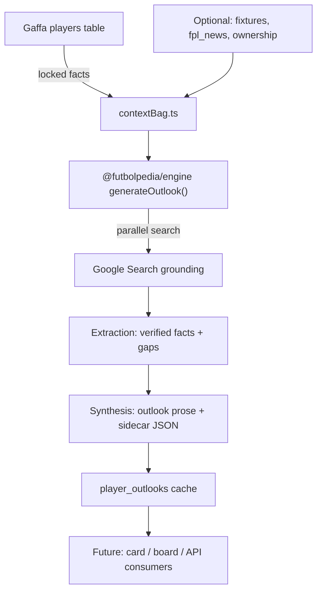

# Futbolpedia Outlook — player evaluation copy for Gaffa

**Date:** 2026-08-26  
**Status:** APPROVED — 2026-08-26 (Duke)  
**Scope:** Text generation pipeline, shared engine extraction, Gaffa-side cache + batch population. **No UI in v1.**

---

## 1. Problem

Gaffa's player card is dense with league performance data (ratings, points, game log, ownership) but thin on **qualitative football evaluation** — the kind of short outlook managers expect from fantasy analysts: health, squad role, career phase, what to expect week to week, and a scout's read on the asset over the rest of the season and beyond.

Futbolpedia already produces opinionated, grounded player analysis via a multi-stage Gemini pipeline (search → extraction → synthesis) with strict anti-hallucination protocols. The collaboration goal is to bring that voice into Gaffa as **ambient player outlooks** for the regular Prem player pool (~250–350), not as a buried on-demand tab few managers open.

This spec covers **getting the text right first**. Where and how outlooks render in the player card (or elsewhere) is explicitly deferred.

---

## 2. Product shape

### 2.1 What managers read

One flowing **outlook paragraph** per player, roughly **70–110 words**. Prose only — no headings, no labeled horizons, no bullet lists in the user-facing copy.

Each outlook must **cover the same important points** but with **player-specific shape and Futbolpedia voice**. Two outlooks should not read like they came from the same template.

**Invisible coverage brief** (satisfied in any order, woven into the paragraph):

| Anchor | What to communicate |
|---|---|
| **Status** | Health and availability in plain language — fit, doubtful, returning, suspended, or clearly unknown |
| **Role** | Where he sits in the squad: starter vs rotation, set pieces, competition for minutes, tactical position |
| **Expectation** | What managers can realistically expect week to week — floor, volatility, how value tends to show up |
| **Career point** | Age and phase — emerging, peak, plateau, managed minutes, decline risk |
| **Horizon** | Short-run and longer-run view in the same breath, without labeling them |
| **Evaluation** | Futbolpedia's opinionated read on the asset — reliability, upside, volatility, dynasty durability — **without** buy/hold/sell/drop advice |

**Banned in user-facing copy:**

- Buy / hold / sell / monitor / strong buy / fade / target language  
- "In Gaffa terms", "in Gaffa", "for fantasy managers", "from an FPL perspective"  
- Stock openings repeated across players ("Nailed starter who…", "From a dynasty perspective…")  
- Using **league fantasy points or match ratings** as evidence of football quality (e.g. "top-scoring CB so he's elite")  
- Explaining or inventing **scoring weights, sigmoid math, or positional rating components**  
- Fabricated matches, quotes, opponents, scores, or stats not present in locked facts or search foundation  

**Allowed:** Mentioning that a player profiles as a steady starter, a volatile weekly scorer, a low-ceiling defensive floor, or a long-term developmental asset — as **football/scout judgments**, not market instructions.

### 2.2 Machine sidecar (not shown as structure)

Stored alongside the paragraph for filtering, QA, and refresh logic:

```typescript
interface PlayerOutlookSidecar {
  evaluation_tags: string[];  // e.g. reliable_starter, set_piece_routes, plateau, minutes_risk
  confidence: 'high' | 'medium' | 'low';
  horizons_touched: ('near' | 'long')[];  // self-check only — never rendered
  evidence_gaps: string[];    // internal QA: what couldn't be verified
  generated_at: string;       // ISO timestamp
  model_id: string;           // which model produced this
  pipeline_version: string;   // semver for prompt/schema changes
}
```

No `lean`, no trade recommendation enum.

### 2.3 Example targets (hand-written reference tone)

**Established CB, durable floor**

> Tarkowski is fit and entrenched as Everton's first-choice centre-back — ninety minutes most weeks, heavy on clearances and aerial duels, light on progressive carrying or open-play creation. At 32 he's in the plateau phase of his career: reliability and defensive volume, not a late breakout. Expect steady involvement rather than spike weeks unless set pieces or an unusually open opponent tilt the game. Profiles as the kind of CB you roster for durability and positional certainty, not upside chasing.

**Premium mid, role + volatility**

> Szoboszlai looks nailed in Liverpool's midfield with set-piece and penalty responsibility — last season's chance volume supports real involvement, not a cosmetic role. The wrinkle is tactical: deeper usage in preseason would cap his ceiling if it sticks, but set-piece load keeps a floor either way. Peak-age contributor with multiple routes to weekly output and real variance tied to where he's deployed. Long-term value depends on Liverpool keeping him advanced and on the ball rather than as a deeper controller.

These are **tone references**, not golden-test fixtures.

---

## 3. Non-goals (v1)

- UI placement in `PremiumPlayerCard`, auction board, or stats table  
- Full 25-attribute Futbolpedia dossiers in Gaffa  
- Buy/hold/sell or auction bid guidance  
- Deriving Futbolpedia ratings from Gaffa points, SoFIFA attrs, or market value formulas  
- Populating the entire ~600+ registered PL player long tail on day one  
- Explaining Gaffa's scoring engine to managers via AI  
- A public HTTP microservice between two deployed apps (package import is enough for v1)

---

## 4. Architecture

### 4.1 Shared engine package

Extract a server-safe subset of Futbolpedia's Gemini pipeline into a shared package (working name `@futbolpedia/engine`, location TBD — monorepo or npm workspace between the two repos).

**Package owns:**

- Outlook-specific prompt + `responseSchema`  
- Search / extraction / synthesis orchestration for outlook mode (lighter than full dossier)  
- Anti-hallucination protocol blocks reused from Futbolpedia `constants.ts` (Protocols E, L, M, P, etc.)  
- Types: `PlayerOutlook`, `PlayerOutlookSidecar`, `OutlookContextBag`  
- Slug helpers, cache key helpers  

**Package does NOT own:**

- React, Vite, browser Supabase client  
- Gaffa DB writes  
- Full `PlayerProfile` / 25-attribute dossier schema (separate export path; outlook is its own mode)

**Futbolpedia app** continues to use the package for chat + dossiers. **Gaffa** imports it from Next.js API routes and batch scripts only (never client-side — `API_KEY` stays server-side).

### 4.2 Gaffa integration surface

```
src/lib/outlook/
  contextBag.ts       # Build locked facts from Supabase Player row + optional league context
  cache.ts            # Read/write player_outlooks table
  generate.ts         # Call @futbolpedia/engine with context bag
  population.ts       # Batch job: regulars set, refresh policy

scripts/
  generate-outlooks.mjs   # CLI batch runner (outside Next.js)

src/app/api/admin/outlooks/   # Optional: manual regen endpoint (CRON_SECRET gated)
```

No UI routes in v1.

### 4.3 Data flow



**Critical rule:** Gaffa performance fields (`total_points`, `form`, `form_rating`, `ppg`) may be passed to the model **only under a `reference_only_do_not_rate_from` block** for optional UI-adjacent context, or omitted entirely in v1. They must never appear in the synthesis prompt as quality evidence.

---

## 5. Context bag (locked facts)

Built server-side from Gaffa Supabase before any LLM call. The model may **not contradict** these fields.

```typescript
interface OutlookContextBag {
  // Identity — required
  player_id: string;
  name: string;
  display_name: string;
  age: number | null;
  nationality: string | null;
  club: string;
  primary_position: GranularPosition;
  secondary_positions: GranularPosition[];

  // Status — required when known
  availability: 'available' | 'injured' | 'doubtful' | 'suspended' | 'unavailable' | 'unknown';
  injury_news: string | null;   // raw fpl_news when present

  // Squad / market context — optional but valuable
  market_value_eur_m: number | null;
  is_new_to_prem: boolean;
  academy_eligible: boolean;    // U21 cutoff

  // Temporal anchors — required
  simulation_date: string;      // ISO date; mirrors Futbolpedia SIMULATION_YEAR/SEASON pattern
  current_season: string;       // e.g. "2026-27"

  // Explicitly excluded from rating inputs (may be omitted in v1)
  // gaffa_total_points, gaffa_form, gaffa_form_rating — DO NOT pass as evidence
}
```

**Dynasty framing:** The context bag includes `is_dynasty_league: true` and player age/academy flags so the model weighs multi-year asset quality — but outlook copy must **not** read as dynasty-only. Short-run role and fitness matter equally.

**Gaffa mechanics the model may know (facts, not math):**

- Twelve tactical positions and exact-position eligibility  
- That the league is multi-year with one draft ever  
- Academy is for U21 prospects  

**Gaffa mechanics the model must NOT explain or invent:**

- Sigmoid weights, component scores, rare-feat bonuses, bench depth bonus percentages  
- Specific point totals or "he'll score X per week" projections  

---

## 6. Pipeline — outlook mode

Outlook mode is a **lighter variant** of Futbolpedia's default dossier pipeline. Target **~3–4 Gemini calls** per player vs ~7 for a full dossier.

### Stage 1 — Query generation (Flash)

Input: player name + locked context bag + outlook task instruction.  
Output: **2–3** targeted search queries (not 4) focused on:

- Current availability and squad role  
- Recent usage / tactical deployment  
- Career phase and competition for minutes  

Skip prime/historical/all-time vectors unless the player is explicitly a legacy query.

### Stage 2 — Factual foundation (Flash + googleSearch, parallel)

Run queries in parallel. Capture grounding source URLs for audit.  
Retry with backoff on 429 (reuse Futbolpedia pattern).

### Stage 3 — Extraction (Flash + responseSchema)

Distill foundation into:

```typescript
interface OutlookExtraction {
  verified_facts: string[];       // bullet facts with source alignment
  status_summary: string;         // injury/availability in plain language
  role_summary: string;           // how he's used
  career_phase: 'emerging' | 'peak' | 'plateau' | 'decline_risk' | 'unknown';
  data_gaps: string[];            // what search couldn't confirm
  conflicting_reports: string[];  // e.g. two sources disagree on role
}
```

If `data_gaps` is non-empty, downstream synthesis must hedge — not fill gaps with memory.

### Stage 4 — Synthesis (Flash or Pro + responseSchema)

**No `thinkingConfig` when `responseSchema` is set** (Futbolpedia quirk — prevents malformed JSON).

Output:

```typescript
interface PlayerOutlook {
  outlook: string;                // 70–110 words, flowing prose
  sidecar: PlayerOutlookSidecar;
}
```

System instruction additions for outlook mode:

- Coverage brief (§2.1)  
- Ban list (§2.1)  
- "Locked facts are law" preamble with full context bag inlined  
- Protocol E/L/M excerpts: no fabricated match events, no stat-locked superlatives without evidence, temporal firewall for current season  
- Explicit: **Do not derive quality from fantasy scoring data**  
- Voice: Futbolpedia scout — specific, opinionated, varied rhythm player to player  

On schema enforcement failure: one retry with `ThinkingLevel.MINIMAL`, then fail closed (no outlook stored; log for batch retry).

---

## 7. Population strategy

### 7.1 Who gets an outlook (Pool B)

**~250–350 "regulars"** — players with meaningful minutes and/or market relevance in the current PL season. Exact cutoff is a SQL query, not a hand list:

- `is_active = true`  
- AND (`matches_played >= N` OR `market_value >= €XM` OR on any league roster OR on active auction/listing)  

Tune `N` and `€XM` so the batch size lands in the 250–350 band. Document the chosen thresholds in `population.ts`.

**Long tail:** No batch generation. Generate on first admin-triggered regen or when a player enters the regulars set mid-season.

### 7.2 Refresh policy

| Trigger | Action |
|---|---|
| Initial batch | Generate all regulars |
| `fpl_status` or `fpl_news` change | Regen if outlook older than 7 days |
| `primary_position` or club change | Force regen |
| Age / season rollover | Batch refresh regulars |
| Default TTL | 30 days if no other trigger |

Store `generated_at`, `pipeline_version`, and hash of context bag fields that affect copy. Skip regen if hash unchanged and within TTL.

### 7.3 Cost control

Assumptions (verify against Google AI Studio billing):

- Outlook mode ≈ 3–4 Flash calls × ~250–350 players ≈ 750–1400 calls for initial seed  
- Monthly refresh of changed subset ≈ tens of calls/week if triggers are tight  

**Rules:**

- Never batch-generate all ~600+ registered players blindly  
- Never regen on every card open — cache first  
- Batch runner supports `--limit`, `--player-id`, `--dry-run` (print context bag only)  
- Log token usage per player for the first 20 runs to calibrate budget  

If monthly spend cap is hit, batch pauses and serves stale cache with `confidence: low` flag — does not silently invent fresh copy.

---

## 8. Storage

New Gaffa table (migration TBD):

```sql
create table player_outlooks (
  player_id uuid primary key references players(id) on delete cascade,
  outlook text not null,
  sidecar jsonb not null default '{}',
  context_hash text not null,
  pipeline_version text not null,
  generated_at timestamptz not null default now(),
  updated_at timestamptz not null default now()
);
```

RLS: readable by authenticated league members; writable only via service role / admin routes.

Futbolpedia's existing `player_profiles` Supabase cache remains separate — outlooks are Gaffa-scoped and keyed on `player_id`, not slug.

---

## 9. Anti-hallucination and quality gates

### 9.1 Hard gates (automated, pre-store)

Reject and do not cache if:

- `outlook` word count outside 50–130  
- Locked fact contradiction detected (simple regex / LLM judge — see §9.3)  
- Banned phrase list hit (`buy`, `hold`, `sell`, `in gaffa`, `FPL perspective`, etc.)  
- `confidence: high` when `evidence_gaps.length > 2`  
- Outlook cites a specific match score/opponent not in `verified_facts`  

On reject: log player_id, retry once, then mark failed in batch report.

### 9.2 Futbolpedia engine improvements (required for collab)

These changes live in the shared package and benefit Futbolpedia too:

1. **Locked-facts preamble** — structured context bag injected before every synthesis call  
2. **Extraction gap → hedge rule** — if gaps exist, synthesis must use uncertain language or omit the claim  
3. **Stat-lock for outlook** — no "prolific", "clinical", "world-class" without a verified stat or event in foundation  
4. **Temporal firewall** — current-season outlook must not cite wrong-season stats as current  
5. **Scoring-data firewall** — prompt block explicitly forbids using passed-in fantasy stats as quality evidence  

### 9.3 Golden eval set

Before batch seeding, build **~30 golden cases** across:

- Fit starter, rotation risk, returning from injury, suspended  
- Peak age, emerging U21, plateau CB, decline-risk veteran  
- New-to-Prem, position change, set-piece dependent  
- Thin search data (should → low confidence + hedge)  
- High Gaffa scorer who should NOT get inflated football praise (Tarkowski-style guard)  

Each case includes:

- Frozen `OutlookContextBag`  
- Frozen mock `OutlookExtraction` (for unit tests) or recorded search snapshot  
- Rubric: factual anchors present, no banned phrases, no scoring-data inflation, voice quality (human review)  

Run eval in CI on prompt changes (`npm test` in engine package).

---

## 10. Implementation phases

### Phase 0 — Spec approval (this document)

Duke reviews and signs off before code.

### Phase 1 — Engine extraction + outlook mode

- Create `@futbolpedia/engine` with server-safe Gemini client  
- Implement `generateOutlook(contextBag)` end-to-end  
- Golden eval suite (30 cases)  
- CLI: `node scripts/generate-outlook.mjs --player-id <uuid> --print`  

**Exit criteria:** 30/30 golden cases pass hard gates; 5 manual spot-checks read well.

### Phase 2 — Gaffa cache + batch

- Migration: `player_outlooks`  
- `contextBag.ts`, `cache.ts`, `population.ts`  
- Batch seed regulars pool  
- Admin regen route (CRON_SECRET)  

**Exit criteria:** 250–350 outlooks stored; batch report with failure list; spend logged.

### Phase 3 — Futbolpedia engine hardening

- Port improved anti-hallucination blocks back into Futbolpedia chat/dossier paths  
- Optional: Futbolpedia standalone "outlook" query mode for parity testing  

### Phase 4 — UI (separate spec)

- Where outlook renders on card / board / stats  
- Card redesign if needed  
- Stale indicator when `confidence: low` or TTL exceeded  

---

## 11. Open questions

1. **Exact regulars SQL thresholds** — pick after inspecting current season minutes distribution.  
2. **Model choice for synthesis** — Flash vs Pro for outlook; default Flash, Pro for golden-set failures only.  
3. **Monorepo layout** — single workspace vs published private package; decide at Phase 1.  
4. **Shared Supabase vs Gaffa-only cache** — v1 is Gaffa-only table; revisit if Futbolpedia site should show same outlook.  

---

## 12. Success criteria

- A manager reading an outlook gets: status, role, expectation, career phase, and a clear scout evaluation — without trade advice or cringe meta-labels.  
- Outlooks feel individually written, not templated.  
- No outlook stored that cites fabricated matches or inflates quality from league scoring.  
- ~250–350 regulars populated within monthly Gemini budget.  
- UI deferred; text quality proven via eval + manual review first.
